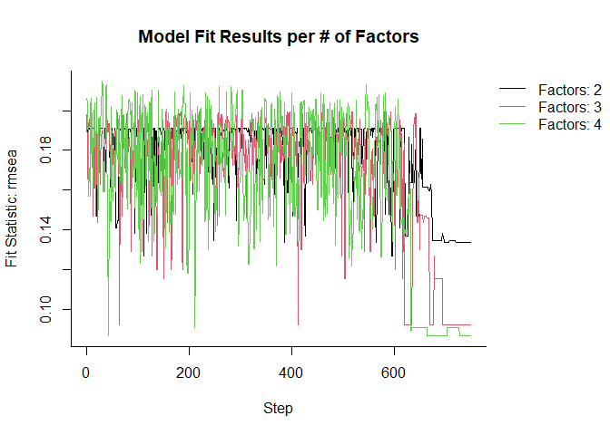

mecfa README
================
Anthony Raborn
2021-05-18

[](https://travis-ci.org/AnthonyRaborn/mecfa)
[](https://codecov.io/gh/AnthonyRaborn/mecfa)

# mecfa: Metaheuristic Exploratory/Confirmatory Factor Analysis

An R package which utilizes metaheuristic algorithms to simultaneously
find the best-fitting model for various factor structures and select
which factor structure has the highest fit. Currently, simulated
annealing is the only metaheuristic algorithm in use, but ant colony
optimization may be incorporated in the future.

# Installation

To install this package, you must have `devtools` installed! It is only
found on GitHub at the moment.

``` r
require(devtools)
devtools::install_github("AnthonyRaborn/mecfa") # automatically installs stable branch
```

# Usage

The goal of `mecfa` is to find the best-fitting confirmatory factor
analysis from a range of possible latent factors. (If you are unsure of
what this means, [here is an article which talks about the
basics](https://stats.idre.ucla.edu/spss/seminars/introduction-to-factor-analysis/a-practical-introduction-to-factor-analysis-confirmatory-factor-analysis/)).
It fits these CFA models using the `lavaan` software.

To start, you need a dataset, some initial models, and the `mecfa`
package.

## System Information

``` r
sessionInfo()
```

    ## R version 4.0.5 (2021-03-31)
    ## Platform: x86_64-w64-mingw32/x64 (64-bit)
    ## Running under: Windows 10 x64 (build 19041)
    ## 
    ## Matrix products: default
    ## 
    ## locale:
    ## [1] LC_COLLATE=English_United States.1252 
    ## [2] LC_CTYPE=English_United States.1252   
    ## [3] LC_MONETARY=English_United States.1252
    ## [4] LC_NUMERIC=C                          
    ## [5] LC_TIME=English_United States.1252    
    ## 
    ## attached base packages:
    ## [1] stats     graphics  grDevices utils     datasets  methods   base     
    ## 
    ## loaded via a namespace (and not attached):
    ##  [1] compiler_4.0.5    magrittr_2.0.1    tools_4.0.5       htmltools_0.5.1.1
    ##  [5] yaml_2.2.1        stringi_1.6.1     rmarkdown_2.8     knitr_1.33       
    ##  [9] stringr_1.4.0     xfun_0.22         digest_0.6.27     rlang_0.4.11     
    ## [13] evaluate_0.14

## Data

``` r
library(mecfa)
```

    ## Loading required package: lavaan

    ## This is lavaan 0.6-8
    ## lavaan is FREE software! Please report any bugs.

``` r
# sample data to use
testData <-
  lavaan::HolzingerSwineford1939
```

The `lavaan` Holzinger-Swineford dataset is a 9-item test of mental
ability for 7th and 8th-grade children. It also includes other variables
which may be of interest for structural equation modeling, but we will
ignore these for now.

The test items are labeled `x1` thru `x9`, so we can use these as our
item names when we create the different initial models. While the
generally-accepted model has 3 factors, we will investigate 2, 3, and 4
factors for this example.

## Initial Models

``` r
factorsNames <-
  c("visual", "textual", "speed", "accuracy")
itemNames <-
  paste0("x", 1:9)
initialModels <-
  createInitialModels(
    maxFactors = factorsNames,
    items = itemNames)
    
cat(
  paste(
    initialModels,
    collapse = "\n\n"
  )
)
```

    ## visual =~ x2 + x4 + x6 + x8 
    ##  textual =~ x1 + x3 + x5 + x7 + x9
    ## 
    ## visual =~ x3 + x6 + x9 
    ##  textual =~ x2 + x5 + x8 
    ##  speed =~ x1 + x4 + x7
    ## 
    ## visual =~ x4 + x8 
    ##  textual =~ x3 + x7 
    ##  speed =~ x2 + x6 
    ##  accuracy =~ x1 + x5 + x9

## Function Specifications

``` r
maxSteps <-
  750
fitStatistic <-
  "rmsea"
maximize <-
  FALSE
lavaan.model.specs <-
  list(
    model.type = "cfa", 
    auto.var = TRUE, 
    estimator = "default",
    ordered = NULL,
    int.ov.free = TRUE, 
    int.lv.free = FALSE, 
    std.lv = TRUE, 
    auto.fix.first = FALSE, 
    auto.fix.single = TRUE, 
    auto.cov.lv.x = TRUE, 
    auto.th = TRUE, 
    auto.delta = TRUE, 
    auto.cov.y = TRUE,
    auto.efa = TRUE,
    missing = "listwise"
    )
maxChanges <-
  2
temperatureFunction <-
  "quadratic"
```

## Execute Function

``` r
example <-
  exploratorySA(
    initialModels = initialModels,
    originalData = testData,
    maxSteps = maxSteps,
    fitStatistic = fitStatistic,
    maximize = maximize,
    lavaan.model.specs = lavaan.model.specs,
    temperature = temperatureFunction
  )
```

    ## discovered package(s): 
    ## automatically exporting the following variables from the local environment:
    ##   bifactor, fitStatistic, initialModels, Kirkpatrick, lavaan.model.specs, maxChanges, maximize, maximumConsecutive, maxSteps, originalData, randomNeighbor, restartCriteria, temperature 
    ## explicitly exporting package(s): 
    ## numValues: 3, numResults: 0, stopped: TRUE
    ## numValues: 3, numResults: 1, stopped: TRUE
    ## returning status FALSE
    ## numValues: 3, numResults: 2, stopped: TRUE
    ## returning status FALSE
    ## numValues: 3, numResults: 3, stopped: TRUE
    ## calling combine function
    ## evaluating call object to combine results:
    ##   fun(accum, result.1, result.2, result.3)
    ## returning status TRUE

## Investigate Results

``` r
# show/print method
example
```

    ## ECFA Algorithm: Simulated Annealing
    ## Total Run Time: 5.809 mins
    ## ECFA Function Call:
    ## exploratorySA(initialModels = initialModels, originalData = testData, maxSteps =
    ##   maxSteps, fitStatistic = fitStatistic, maximize = maximize, lavaan.model.specs
    ##   = lavaan.model.specs, temperature = temperatureFunction)
    ## 
    ## Best Model Function Call:
    ## ecfaSA(initialModel = lavaan::cfa(model = initialModels[chain], data =
    ##   originalData, model.type = model.type, estimator = estimator, ordered =
    ##   ordered, int.ov.free = int.ov.free, int.lv.free = int.lv.free, auto.fix.first
    ##   = auto.fix.first, std.lv = std.lv, auto.fix.single = auto.fix.single, auto.var
    ##   = auto.var, auto.cov.lv.x = auto.cov.lv.x, auto.efa = auto.efa, auto.th =
    ##   auto.th, auto.delta = auto.delta, auto.cov.y = auto.cov.y, missing = missing),
    ##   originalData = originalData, maxSteps = maxSteps, fitStatistic = fitStatistic,
    ##   temperature = temperature, maximize = maximize, Kirkpatrick = Kirkpatrick,
    ##   randomNeighbor = randomNeighbor, lavaan.model.specs = lavaan.model.specs,
    ##   maxChanges = maxChanges, restartCriteria = restartCriteria, maximumConsecutive
    ##   = maximumConsecutive, bifactor = bifactor)
    ## 
    ## Final Model Syntax:
    ## accuracy =~ x4 + x5 + x6
    ## speed =~ x1 + x2
    ## textual =~ x7 + x8
    ## visual =~ x3 + x9
    ## speed ~~ accuracy
    ## textual ~~ accuracy + speed
    ## visual ~~ accuracy + speed + textual
    ## Best Model Fit Using rmsea: 0.086

``` r
# summary method
summary(example)
```

    ## lavaan 0.6-8 ended normally after 28 iterations
    ## 
    ##   Estimator                                         ML
    ##   Optimization method                           NLMINB
    ##   Number of model parameters                        24
    ##                                                       
    ##   Number of observations                           301
    ##                                                       
    ## Model Test User Model:
    ##                                                       
    ##   Test statistic                                68.168
    ##   Degrees of freedom                                21
    ##   P-value (Chi-square)                           0.000
    ## 
    ## Parameter Estimates:
    ## 
    ##   Standard errors                             Standard
    ##   Information                                 Expected
    ##   Information saturated (h1) model          Structured
    ## 
    ## Latent Variables:
    ##                    Estimate  Std.Err  z-value  P(>|z|)
    ##   accuracy =~                                         
    ##     x4                0.990    0.057   17.487    0.000
    ##     x5                1.102    0.063   17.598    0.000
    ##     x6                0.916    0.054   17.068    0.000
    ##   speed =~                                            
    ##     x1                0.821    0.088    9.291    0.000
    ##     x2                0.496    0.076    6.516    0.000
    ##   textual =~                                          
    ##     x7                0.658    0.076    8.647    0.000
    ##     x8                0.813    0.079   10.299    0.000
    ##   visual =~                                           
    ##     x3                0.585    0.072    8.127    0.000
    ##     x9                0.639    0.067    9.521    0.000
    ## 
    ## Covariances:
    ##                    Estimate  Std.Err  z-value  P(>|z|)
    ##   speed ~~                                            
    ##     accuracy          0.547    0.076    7.224    0.000
    ##   textual ~~                                          
    ##     accuracy          0.208    0.071    2.926    0.003
    ##     speed             0.302    0.091    3.310    0.001
    ##   visual ~~                                           
    ##     accuracy          0.375    0.080    4.654    0.000
    ##     speed             1.001    0.105    9.505    0.000
    ##     textual           0.710    0.085    8.332    0.000
    ## 
    ## Variances:
    ##                    Estimate  Std.Err  z-value  P(>|z|)
    ##     accuracy          1.000                           
    ##     speed             1.000                           
    ##     textual           1.000                           
    ##     visual            1.000                           
    ##    .x1                0.684    0.123    5.577    0.000
    ##    .x2                1.136    0.101   11.269    0.000
    ##    .x3                0.932    0.089   10.520    0.000
    ##    .x4                0.371    0.048    7.788    0.000
    ##    .x5                0.445    0.058    7.640    0.000
    ##    .x6                0.358    0.043    8.316    0.000
    ##    .x7                0.750    0.091    8.281    0.000
    ##    .x8                0.360    0.106    3.389    0.001
    ##    .x9                0.607    0.073    8.257    0.000

``` r
# plot method
plot(example)
```

<!-- -->

It took a total of 5.83 mins to compile this document.
